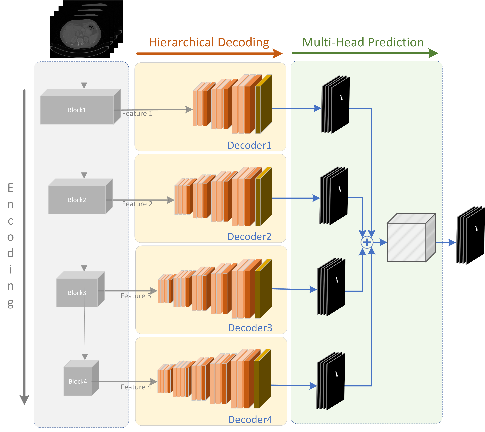
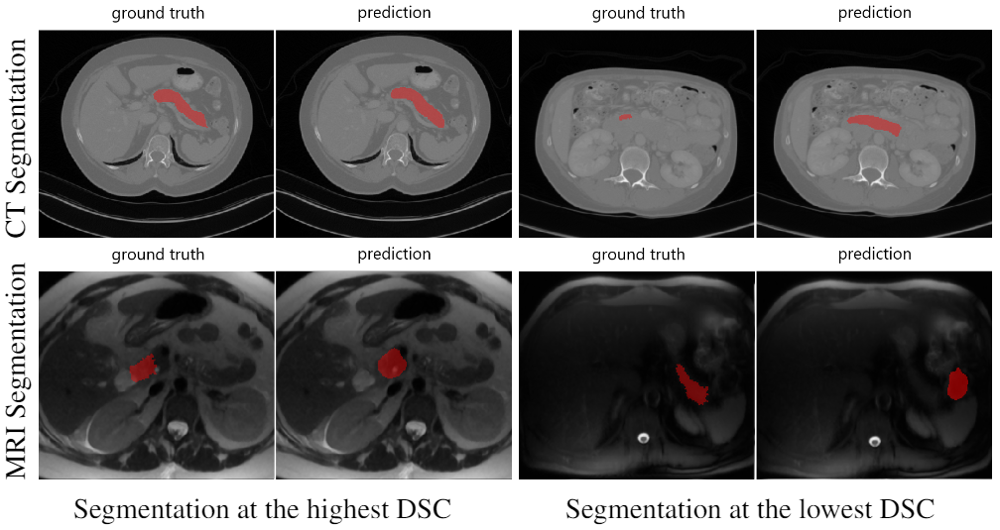

# PankNet
[Hierarchical 3D Feature Learning for Pancreas Segmentation]

Novel 3D fully convolutional deep network for automated pancreas segmentation from both MRI and CT scans. The proposed model consists of a 3D encoder that learns to extract volume features at different scales; features taken at different points of the encoder hierarchy are then sent to multiple 3D decoders that individually predict intermediate segmentation
maps. Finally, all segmentation maps are combined to obtain a unique detailed segmentation mask. The model outperforms existing methods on CT pancreas segmentation on publicly available NIH Pancreas-CT dataset (consisting of 82 contrast-enhanced CTs), obtaining an average Dice score of about 88%. Furthermore, yields promising segmentation performance on a very challenging private MRI dataset, consisting of 40 MRI scans (average Dice score is about 77%).

## Examples

## Notes

- As Feature Extractor, PankNet employs S3D pretained on Kinetics-400 dataset. The S3D weights can be downloaded from [here](https://github.com/kylemin/S3D).
